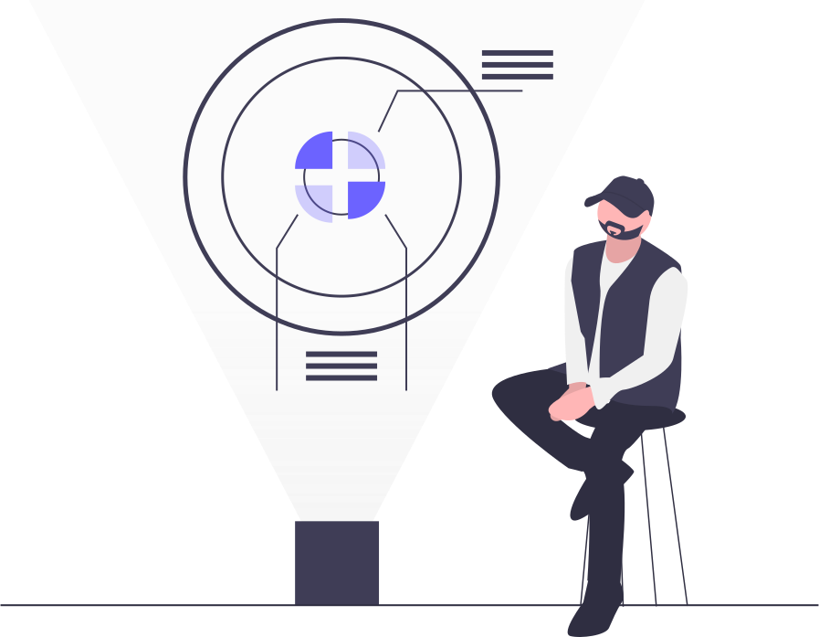

# Devices



This project was kickstarted with the  ***Create React App example with styled-components***, an example folder that can be found within  [material-ui](https://github.com/mui-org/material-ui) repo.  
<br/>
### You can give it a try [**here**](https://github.com/mui-org/material-ui) 
<br/>
It shows the different ways the following tools and patterns can be used:

### React 
- Isolated state through custom hooks.
- Local state for the simpler state needs.
- Optimizations on rendering components for responsiveness. 
### Redux, React-Redux & Redux Toolkit
- State slice creation pattern to quickly develop complex store logic.
- Async data fetching through thunks.
- Continuation patterns for saga-like effects.
### API
- CRUD operations 
- Best practices for response manipulation to better fit app logic and optimize usage of data and requests.

## How to use

Run this little express.js mock [server](https://github.com/NinjaRMM/devicesTask_serverApp) 

*Note: You might have to configure a different ```PORT``` for the server to run along this app on the same computer.*  

### Install the project
```sh
npm install  
```
or 
```sh
npm ci 
```
### Run the web app
```sh
npm start
```

